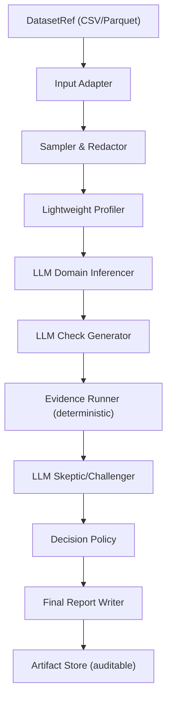

# Autonomous Governance & Validation Agent (LLM-first)

This project is an **independent validation service** that can accept *any* dataset (CSV/Parquet), infer likely domain and expectations using an LLM, generate candidate checks, execute them to gather evidence, run a skeptic pass to reduce false positives, and produce an **auditable** decision and report.

## Key idea
- **LLM decides what to check** (domain inference + hypothesis generation).
- **Deterministic executor measures evidence** (violation rates, examples).
- **LLM skeptic** challenges assumptions and calibrates severity/confidence.

No internal knowledge base is required; the agent relies on LLM general knowledge + dataset signals.

## Repo structure
- `src/autovalidator/core/` sampling, redaction, profiling
- `src/autovalidator/llm/` prompts, schemas, client, orchestrator
- `src/autovalidator/checks/` DSL + evidence executor
- `src/autovalidator/policy/` decision policy
- `src/autovalidator/storage/` run artifacts storage
- `src/autovalidator/api/` FastAPI app
- `src/autovalidator/cli.py` CLI entry

## Mermaid architecture


## Setup
```bash
python -m venv .venv
source .venv/bin/activate
pip install -e .
```

## Environment variables
Set either via shell or `.env`:
- `LLM_BASE_URL` (default: https://api.openai.com/v1)
- `LLM_API_KEY`  (required)
- `LLM_MODEL`    (default: gpt-4.1-mini)

## CLI usage
```bash
python -m autovalidator.cli validate --dataset /path/to/data.csv --out ./out
```

Artifacts will be stored under `./out/runs/<run_id>/`.

## API usage
Run:
```bash
uvicorn autovalidator.api.app:app --reload --port 8000
```

Validate:
```bash
curl -X POST http://127.0.0.1:8000/validate -H "Content-Type: application/json" -d '{"dataset_ref":"./examples/invoices.csv","out_dir":"./out"}'
```

Fetch a run:
```bash
curl http://127.0.0.1:8000/runs/<run_id>
```

## Notes
- This MVP samples data; for very large datasets, you can extend the adapters to push down sampling to your storage engine.
- Redaction is best-effort. For stricter governance, plug in stronger detection/masking.****
